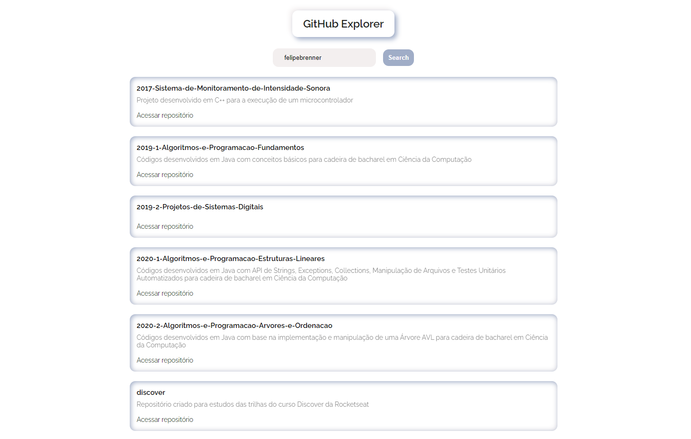

## 💻 Repositório
Repositório criado para o desenvolvimento do Github Explorer, projeto construído durante as aulas do módulo Fundamentos do ReactJS da trilha de ReactJS do Bootcamp Ignite da Rocketseat

<h1 align="center">
  
</h1>

Por Felipe Brenner
